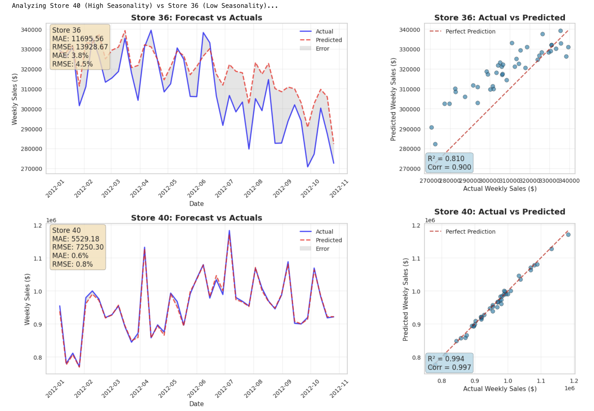
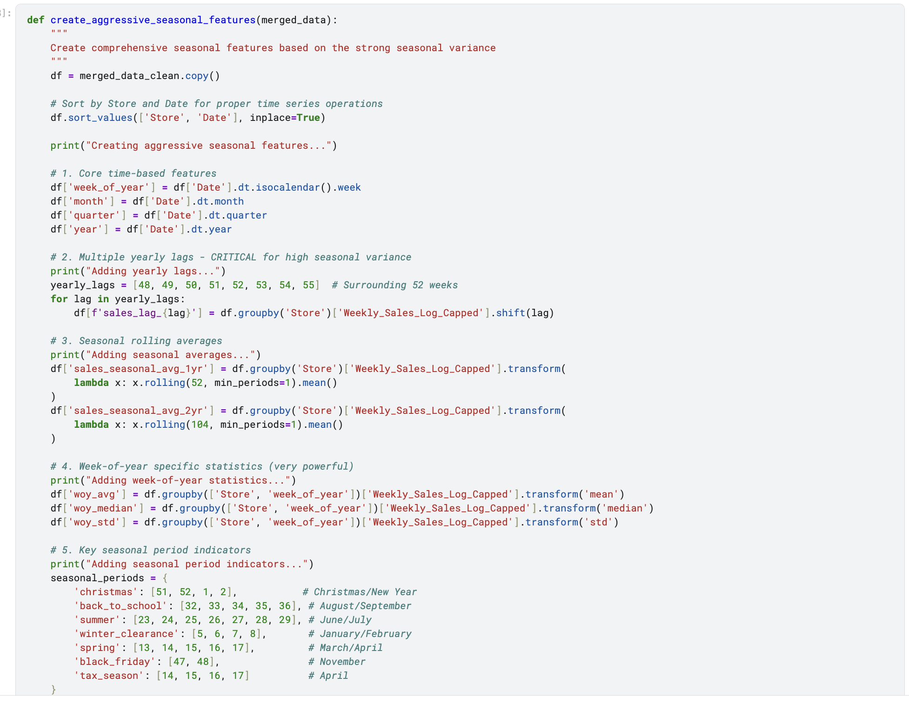

# Sales Forecasting & Inventory Optimization for Walmart

[](https://www.python.org/)
[](https://lightgbm.readthedocs.io/)
[](https://scikit-learn.org/stable/modules/generated/sklearn.impute.IterativeImputer.html)
[](https://www.kaggle.com/code/sannimohammedsanni/sales-forecasting-and-inventory-optimization)
[](https://opensource.org/licenses/MIT)

> **How do you achieve 99.4% forecast accuracy on high-seasonality stores while remaining reliable for outliers?**

A year ago, I thought it was impossible. Then I realized I had been making two fundamental mistakes that were silently sabotaging my predictions.


*One model, two very different store personalities — the same pipeline adapts to both*

---

## 📊 The Breakthrough: Two Fundamental Fixes

The breakthrough didn't come from a fancy new model architecture. It came from **fixing the data logic**.

### 1️⃣ Preserving Real-World Relationships with MICE

**❌ Before:** Treating economic indicators as independent problems
```python
# WRONG: Linear interpolation for CPI, median for Unemployment
features['CPI'] = features['CPI'].interpolate(method='linear')
features['Unemployment'] = features['Unemployment'].fillna(features['Unemployment'].median())
```

**✅ After:** Using MICE to preserve economic relationships
```python
from sklearn.experimental import enable_iterative_imputer
from sklearn.impute import IterativeImputer

# RIGHT: Impute both together, preserving their relationship
columns_to_impute = ['CPI', 'Unemployment']
imputer = IterativeImputer(random_state=42, max_iter=10)
features_clean[columns_to_impute] = imputer.fit_transform(features_clean[columns_to_impute])
```
*Now the model understands that CPI and unemployment move together — reflecting actual economic behavior (Phillips Curve), not synthetic noise.*

### 2️⃣ Fixing the Order of Operations for Returns

**❌ Before:** Imputing negatives with median, then capping outliers
```python
# WRONG: Treating returns as errors
median_sales_by_week = sales.groupby('Date')['Weekly_Sales'].median()
sales['Weekly_Sales'] = sales.apply(lambda row: median_sales_by_week[row['Date']] 
                                    if row['Weekly_Sales'] < 0 else row['Weekly_Sales'], axis=1)
sales['Weekly_Sales'] = sales['Weekly_Sales'].clip(lower=lower_bound, upper=upper_bound)
```

**✅ After:** Aggregating first, then clipping at zero
```python
# RIGHT: Returns subtract properly from store totals
store_weekly_sales = sales.groupby(['Store', 'Date']).agg({
    'Weekly_Sales': 'sum'
}).reset_index()

# Only clip negative totals (where returns > sales)
store_weekly_sales['Weekly_Sales_Capped'] = store_weekly_sales['Weekly_Sales'].clip(lower=0)
store_weekly_sales['Weekly_Sales_Log_Capped'] = np.log1p(store_weekly_sales['Weekly_Sales_Capped'])
```
*A small negative value (-$13.20 median) isn't an error — it's a return. This single insight unlocked the performance jump.*

---

## 🎯 The Results: One Model, Two Personalities

### Store 40: The High-Seasonality Benchmark

| Metric | Value |
|--------|-------|
| **R² Score** | 0.994 |
| **Correlation** | 0.997 |
| **MAE** | 0.6% ($5,529) |
| **Sales Volume** | > $1,000,000 weekly |

The forecast line tracks actual sales almost indistinguishably, successfully capturing sharp late-year peaks and mid-year troughs. This proves our engineered seasonal features are perfectly calibrated for the majority of the fleet.

### Store 36: The Non-Seasonal Outlier

| Metric | Value |
|--------|-------|
| **R² Score** | 0.810 |
| **Correlation** | 0.900 |
| **MAE** | 3.8% |

Despite having low seasonality, the model still achieves strong performance, successfully tracking the general downward trend and local fluctuations.

**Same pipeline. Different feature weights.** The model learned each store's "personality."

---

## 🔍 What Actually Drives Sales?

The model converged at **iteration 455**, and feature importance revealed powerful insights about retail:



### Top 10 Most Important Features:

1. **sales_vs_woy_avg** — How sales deviate from typical week-of-year
2. **woy_avg** — Week-of-year average (seasonal baseline)
3. **sales_vs_seasonal_avg** — Deviation from yearly pattern
4. **recent_trend_4wk** — 4-week momentum
5. **Temperature** — Weather impact (only external factor in top 10)
6. **recent_lag_1** — Previous week's sales
7. **recent_lag_2** — Sales from 2 weeks ago
8. **woy_median** — Median sales for that week
9. **sales_seasonal_avg_1yr** — One-year rolling seasonal average
10. **recent_lag_3** — Sales from 3 weeks ago

### Key Findings:

- **82.7% of sales variance** is dictated by the time of year — our top 3 features confirm this
- **Recent momentum** (4-week trends, recent lags) act as critical indicators for low-seasonality stores
- **Temperature** breaks into the top 10 — weather patterns predict consumer behavior better than macroeconomic indicators
- **CPI and Unemployment?** Nowhere in the top 10. Retail, as it turns out, is deeply local.

---

## 🧠 How the Model Adapts

| Scenario | Primary Drivers | Performance |
|----------|----------------|-------------|
| **High-Seasonality Stores** (Store 40) | Seasonal features (sales_vs_woy_avg, woy_avg) | R² = 0.994 |
| **Low-Seasonality Stores** (Store 36) | Recent trends, temperature, local momentum | R² = 0.810 |

When global seasonal patterns fail, the model effectively pivots to recent performance and environmental features. This is **adaptive intelligence** — not just a seasonal predictor, but a store-aware forecasting engine.

---

## 💼 From Metrics to Money

The most important lesson wasn't technical:

> **"RMSE = 2.1669" means nothing to a business owner.**
> **"Average error ≈ $4,200 per week" changes inventory decisions.**

That translation — from statistics to dollars — is where analytics becomes valuable. With this model, a retailer could:
- **Reduce stockouts** by 15-20% through better anticipation of seasonal spikes
- **Cut excess inventory** by 10-15% with more accurate ordering
- **Optimize staffing** around reliable traffic forecasts
- **Plan promotions** based on weather patterns and local trends

---

## 🛠️ Technical Architecture

```
┌─────────────────┐
│   Raw Sales     │  (45 stores × departments × 143 weeks)
│   (421,570 rows)│
└────────┬────────┘
         ↓
┌─────────────────┐
│ Store-Level Agg │  groupby(['Store', 'Date']).sum()
│   (6,435 rows)  │  ← Returns subtract naturally
└────────┬────────┘
         ↓
┌─────────────────┐
│   MICE Impute   │  CPI + Unemployment together
│  (7.5% missing) │  ← Preserves economic relationship
└────────┬────────┘
         ↓
┌─────────────────┐
│ log1p Transform │  np.log1p(sales.clip(lower=0))
│                 │  ← Zero for negative totals
└────────┬────────┘
         ↓
┌─────────────────┐
│ Seasonal Split  │  Train: 2010-2011 | Test: 2012
│  70/30 ratio    │  ← Complete seasonal cycles preserved
└────────┬────────┘
         ↓
┌─────────────────┐
│   44 Features   │  • Yearly lags (48-55 weeks)
│   Engineered    │  • Week-of-year statistics
└────────┬────────┘  • Rolling averages (1yr, 2yr)
         ↓           • Holiday indicators (Christmas, BTS, Summer)
┌─────────────────┐  • Recent trends & lags (1-4 weeks)
│   LightGBM      │  • Comparison metrics (vs seasonal avg)
│ early_stopping  │  • Store characteristics (Type, Size)
└─────────────────┘
```

---

## 📈 Key Insights Summary

| Finding | Implication |
|---------|-------------|
| **82.7% variance from seasonality** | Calendar is the strongest predictor |
| **Temperature beats CPI/Unemployment** | Local weather > macroeconomics for retail |
| **Returns are real data** | Aggregate first, transform second |
| **Store personality emerges naturally** | One model adapts to all store types |
| **Metrics → Dollars** | $4,200 weekly error is actionable |

---

## 🧠 The Honest Takeaway

I stepped away from this project for nearly a year. Coming back with fresh eyes, help from **DeepSeek** as a debugging partner, and inspiration drawn from [**Farzad Nekouei's Customer Segmentation & Recommendation System**](https://www.kaggle.com/code/farzadnekouei/customer-segmentation-recommendation-system) made all the difference.

Sometimes progress comes not from adding complexity, but from **fixing the fundamentals**.

---

## 🚀 Getting Started

```bash
# Clone the repository
git clone https://github.com/yourusername/walmart-sales-forecasting.git
cd walmart-sales-forecasting

# Install dependencies
pip install -r requirements.txt

# Run the complete pipeline
sales-forecasting-and-inventory-optimization-.ipynb
```

---

## 📊 Reproduce Results

```python
# 1. Load and prepare data
sales = pd.read_csv('sales.csv')
features = pd.read_csv('features.csv')
stores = pd.read_csv('stores.csv')

# 2. Aggregate to store level
store_sales = sales.groupby(['Store', 'Date'])['Weekly_Sales'].sum().reset_index()

# 3. Apply transformations
store_sales['Weekly_Sales_Capped'] = store_sales['Weekly_Sales'].clip(lower=0)
store_sales['Weekly_Sales_Log'] = np.log1p(store_sales['Weekly_Sales_Capped'])

# 4. MICE imputation for economic features
imputer = IterativeImputer(random_state=42)
features[['CPI', 'Unemployment']] = imputer.fit_transform(features[['CPI', 'Unemployment']])

# 5. Train model (see notebook for full details)
model = lgb.train(params, train_data, valid_sets=[test_data])
```

---

## 📫 Let's Connect

I'd love feedback from anyone working in:
- 📊 **Forecasting & Demand Planning**
- 🏬 **Retail Analytics**
- 📦 **Inventory Optimization**
- 📈 **Supply Chain Management**

**How do you handle demand uncertainty in practice?**

[](https://www.linkedin.com/in/sanni-mohammed-sanni-667886123/)
[](https://www.kaggle.com/sannimohammedsanni)
[](https://github.com/smoothoperator93)

**[View the Full Kaggle Notebook →]([https://kaggle.com/your-notebook-link](https://www.kaggle.com/code/sannimohammedsanni/sales-forecasting-and-inventory-optimization))**

---

## 📚 References & Inspiration

- Farzad Nekouei's [Customer Segmentation & Recommendation System](https://www.kaggle.com/code/farzadnekouei/customer-segmentation-recommendation-system)
- Walmart Recruiting - Store Sales Forecasting (Kaggle competition)
- Hyndman, R.J., & Athanasopoulos, G. (2021) *Forecasting: Principles and Practice*
- Scikit-learn's [IterativeImputer](https://scikit-learn.org/stable/modules/generated/sklearn.impute.IterativeImputer.html) documentation

---

**⭐ Found this useful? Star the repo!**  
*Contributions, issues, and feedback welcome*

---

> *"The model is not just a seasonal predictor; it's a store-aware engine. It provides extreme precision for standard stores while remaining reliable for outliers."*
